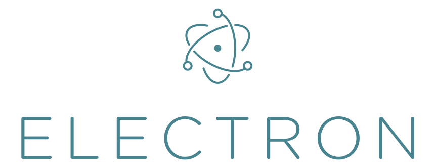

### electron startup

In this notebook we are going to have a look on how we can build effective and efficient cross-platform desktop applications using electron.js.



### Languages

The following languages will be used in this repository.

```shell
- javascript (js)
- typescript (ts)
```

### Getting started.
